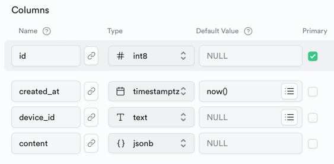

# wifi_battery_monitor

## Credits

* Liberally copied from course materials that are part of [Software Stack in Climate Tech](https://www.terra.do/climate-education/cohort-courses/software-stacks-in-climate-tech/). I highly recommend that everyone involved or interested in how technology can fight climate change take this course.
* Inspiration drawn from a board presentation made on [The Festival of Lights and Climate Change](https://docs.google.com/presentation/d/1xozE2pJLaS6ZU5rT9S0h937FgYKbp3cBDq__n-NryBE/edit#slide=id.g243b82910f1_0_0)
* Errors `GitBlameMe`

## Background

To fight climate change [See FOLPA and Climate Change](https://docs.google.com/presentation/d/1xozE2pJLaS6ZU5rT9S0h937FgYKbp3cBDq__n-NryBE/edit#slide=id.g243b82910f1_0_0), FOLPA recently converted its entire set of Festival of Lights parade floats to LiFePO4 batteries from gas generators (see [Board Float Batterization Presentation](https://docs.google.com/presentation/d/1xozE2pJLaS6ZU5rT9S0h937FgYKbp3cBDq__n-NryBE/edit#slide=id.g243b82910f1_0_0)). The key issue with this change is being sure each float has adequate charge for the complete show (reference [float batteries plan](https://docs.google.com/spreadsheets/d/1jNfh3eLkbha0XVxC8WWYtK-C9kAY6Rwcxe5QWCYV6Zo/edit#gid=0)).

## Parade Float Remote Battery Monitoring System

The goal of this project is to automatically track and report battery storage levels (and other data points of possible interest like GPS location, speed and CO2 levels).

## Summary

Create small, low power sensors that measure battery voltage (and, potentially, other float characteristics of interest) and report back to a central server that will create a real time dashboard of battery charge levels. This will allow us to remotely monitor floats during the off-season, and the critical pre-parade staging in the parking lot (as well as other uses).

Design the whole solution in a manner that allows for simple extension to additional sensors that might have nothing to do with battery charge levels. Ideally use Lora for communications.

### Baseline Goal

Install a Raspberry Pi data collection and reporting server on the Steam Train float and place ESP32 reporting devices on each float directly connected to the batteries for that float. Report battery charge levels to the PiServer. Ideally, battery charge reporting dashboards could be accessed using a mobile phone.

### Stretch Goal1

Enable the sensors to respond to a Pi-server command for a particular float to power on or off.

### Stretch Goal2

Add a GPS sensor that can (phase 1) track and report float position and speed to a log file, and (phase 2) eventually report speed to a LCD screen that displays the walking speed to float pushers in real time.

## Components Overview

- ESP32 IoT devices running `code.py`
- WiFi network hosted by a Raspberry Pi mounted in the cabin of the Steam Train parade float (SSID `folpa` Password `festival`)
- Cellular connection from the Raspberry Pi to the cloud (TBD)
- A Supabase hosted [FOLPA Device Database](https://zuwvqaycrihgxufuzmhu.supabase.co) that provides a RESTful endpoint for querying and managing the device database. The table structure for this database is:

-- See [FOLPA db API documentation](https://supabase.com/dashboard/project/zuwvqaycrihgxufuzmhu/settings/api).
- A Supabase hosted reporting dashboard at [FOLPA Data Logger and Reporter](https://app.hex.tech/software-for-climate/hex/cb167ff0-d352-4704-9ba1-7184362fedae/draft/logic)
- Public web access via computer or mobile devices

## Set Up Hardware

- Connect your ESP32 to your computer using the USB-C data cable. Find the Adafruit CircuitPython Quickstart page for your ESP32 board on [learn.adafruit.com](https://learn.adafruit.com/esp32-s2-reverse-tft-feather/circuitpython).
- Follow the link to “download the latest version of CircuitPython”
- Follow the link to download the `CircuitPython 8.x.x .UF2` file for your device.
- Connect your ESP32 to your computer using a USB-C data cable
- Double-click “reset” button (the second click has to happen after the indicator LED turns purple). You will see a new disk drive appear called `FTHRS2BOOT`
- Drag the downloaded `adafruit-circuitpython-adafruit_[something].uf2` file into the `FTHRS2BOOT` drive
- On Mac OS if this triggers an “unexpected error” dialog, you may need to use your terminal to copy the file - the terminal command will be something like `cp -x ~/Downloads/adafruit-[something].uf2 /Volumes/FTHRS2BOOT`.
- After a few seconds, this drive name will be replaced with `CIRCUITPY`.

## Connect Device to WiFi

Follow directions at [Device Setup | CircuitPython Web Workflow Code Editor Quick Start | Adafruit Learning System](https://learn.adafruit.com/getting-started-with-web-workflow-using-the-code-editor/device-setup) to set up the Integrated Development Environment.

Keeping your device connected to your computer via USB, from your computer:

- Open the `CIRCUITPY` drive
- Open the `settings.toml` file in a text editor
- Replace the contents of the file with this, updating with our Steam Train's wifi settings:
```
CIRCUITPY_WIFI_SSID = "folpa"
CIRCUITPY_WIFI_PASSWORD = "festival"
```
- Press the “reset” button

If wifi setup is successful, you’ll see an IP address appear on the screen after a minute or so

## Device Reporting Code

See `code.py` and `setting.toml` files in this repository. They need to be copied onto the ESP32 mounted as CIRCUITPY on your computer.
